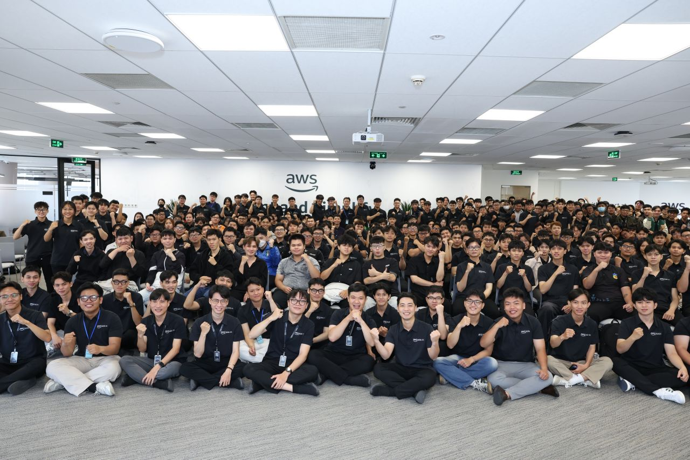
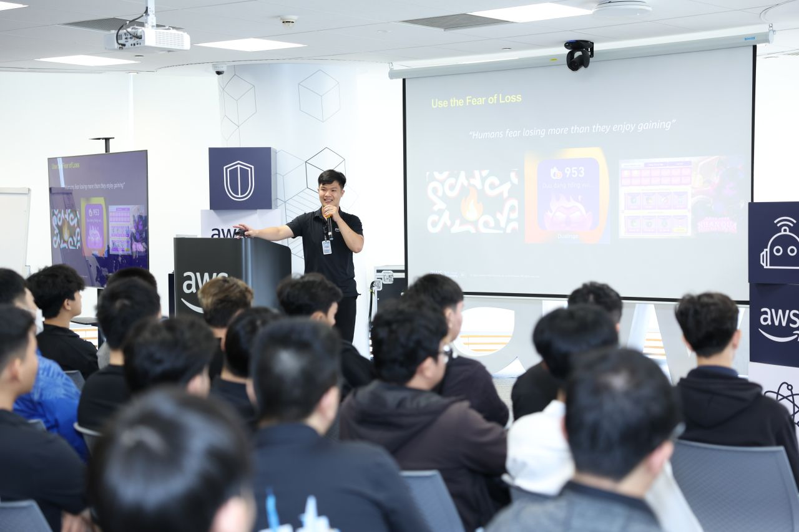
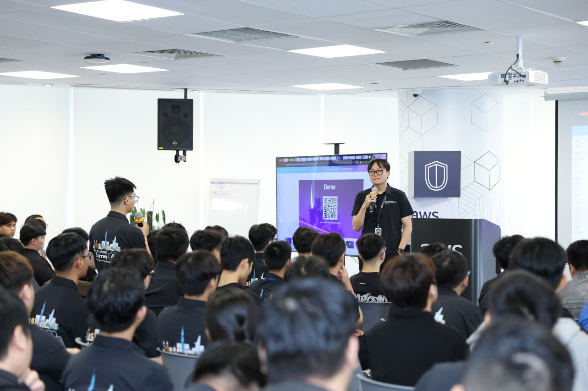
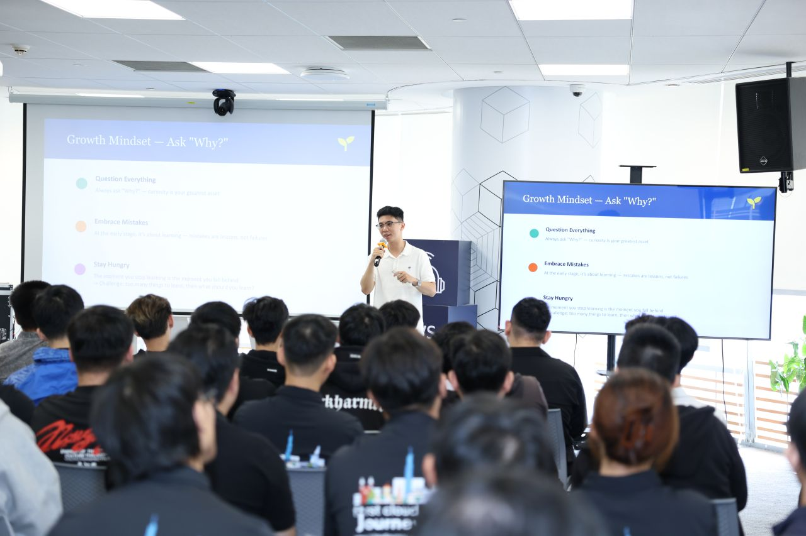
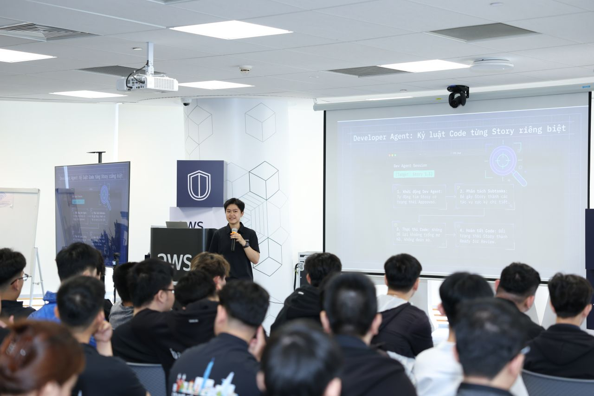

{}
⚠️ **Lưu ý:** Các thông tin dưới đây chỉ nhằm mục đích tham khảo, vui lòng **không sao chép nguyên văn** cho bài báo cáo của bạn kể cả warning này.
{}

# Báo cáo Event 1: Buổi chia sẻ kiến thức FCAJ

## Tóm tắt

Tôi tham gia để lắng nghe và học hỏi, và tôi rời đi với nhiều hơn những gì tôi đến. Tuần này, nhóm FCAJ đã tổ chức một buổi chia sẻ kiến thức nhắc nhở tôi tại sao học tập liên tục là một trong những khoản đầu tư mạnh mẽ nhất mà chúng ta có thể thực hiện - không chỉ với tư cách cá nhân mà còn với tư cách là một nhóm.

## Diễn giả

- [**Khang Nguyen**](https://www.linkedin.com/in/khangck/)
- [**Thịnh Nguyễn**](https://www.linkedin.com/in/thinhnguyen1211/)
- [**Long Hoàng**](https://www.linkedin.com/in/huynhhoanglong1812003/)
- [**Thao Nguyen Phuong**](https://www.linkedin.com/in/thao-ngph/)

## Nội dung chính

- Mỗi người bước lên để chia sẻ phương pháp học tập, khuôn khổ học tập và sự thay đổi tư duy đã định hình cách họ tiếp thu và áp dụng kiến thức.
- Sự đa dạng của các quan điểm trong một căn phòng là điều rất truyền cảm hứng.
- Điều ấn tượng nhất không phải là bất kỳ insights cụ thể nào — mà là năng lượng tập thể.

## Điều tôi ấn tượng nhất

- Một nhóm thực sự tò mò và sẵn sàng dễ bị tổn thương về những gì họ không biết.
- Mọi người háo hức nâng đỡ lẫn nhau, tạo thành một đội được xây dựng cho thời gian dài.
- Học không dừng lại khi bạn rời khỏi lớp học; nó trở nên sâu sắc hơn khi bạn vây quanh mình với những người thách thức bạn suy nghĩ khác đi.

## Bài học rút ra

- Làm việc chung để học hỏi là con đường tốt nhất để phát triển.
- Sự phát triển là trách nhiệm chung, không chỉ của một cá nhân.
- Nên có thêm nhiều phiên như thế này để củng cố văn hóa học tập trong nhóm.

## Kết luận

Tôi tự hào là một phần của nhóm coi sự phát triển là trách nhiệm chung. Đây là nhiều phiên khác như thế này. 💡
- Các công cụ AI như Amazon Q Developer có thể **boost productivity** nếu được tích hợp vào workflow phát triển hiện tại.

#### Một số hình ảnh khi tham gia sự kiện

> Tổng thể, sự kiện không chỉ cung cấp kiến thức kỹ thuật mà còn giúp tôi thay đổi cách tư duy về thiết kế ứng dụng, hiện đại hóa hệ thống và phối hợp hiệu quả hơn giữa các team.
