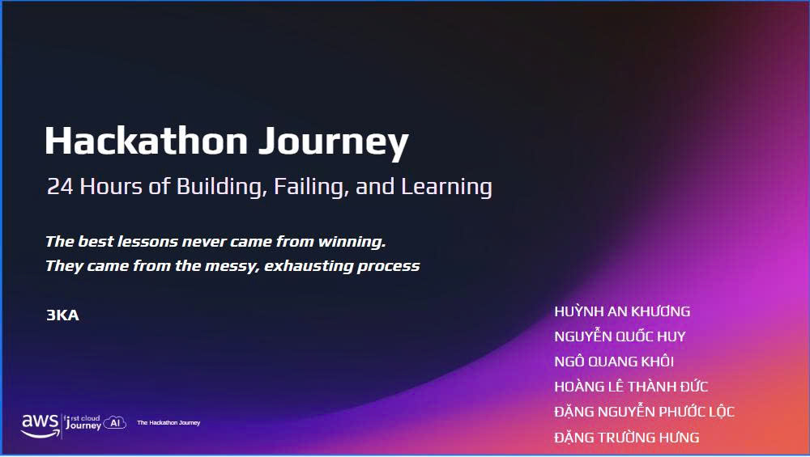
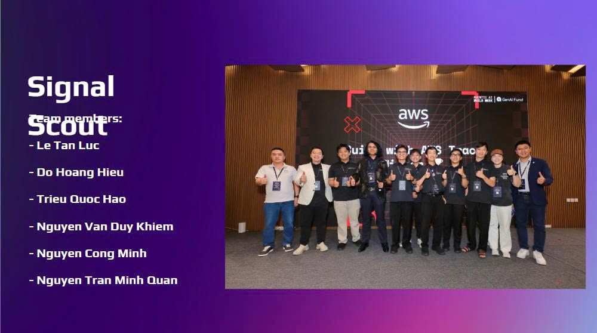

{}
⚠️ **Lưu ý:** Nội dung dưới đây chỉ mang tính chất tham khảo. Vui lòng **không sao chép nguyên văn** vào báo cáo của bạn, bao gồm cả phần cảnh báo này.
{}

# Báo cáo Sự kiện 2: AWS Hackathon & Amazon Q Developer

## Tổng quan

Trong thời gian thực tập, tôi đã theo dõi buổi chia sẻ về **AWS Hackathon** – một chương trình giúp các lập trình viên áp dụng kiến thức AWS để giải quyết các bài toán thực tế trong thời gian giới hạn. Bên cạnh việc giới thiệu thể lệ cuộc thi, diễn giả còn chia sẻ cách sử dụng **Amazon Q Developer** để hỗ trợ quá trình phát triển ứng dụng, từ phân tích yêu cầu, viết mã nguồn đến tối ưu giải pháp trên nền tảng AWS.

Buổi chia sẻ giúp tôi hiểu rõ hơn về quy trình tham gia một cuộc thi Hackathon cũng như cách kết hợp giữa kỹ năng lập trình, làm việc nhóm và các công cụ AI để nâng cao hiệu quả phát triển phần mềm.

## Diễn giả

- **Đội ngũ AWS/FCAJ Knowledge Sharing**

## Những điều tôi học được

- Hiểu mục tiêu và quy trình tổ chức của AWS Hackathon.
- Biết cách xây dựng ý tưởng và phân chia công việc trong thời gian ngắn.
- Tìm hiểu vai trò của Amazon Q Developer trong việc hỗ trợ lập trình, giải thích mã nguồn và đề xuất các giải pháp trên AWS.
- Hiểu tầm quan trọng của việc lựa chọn kiến trúc phù hợp để xây dựng ứng dụng Cloud.
- Nhận thấy kỹ năng làm việc nhóm, quản lý thời gian và trình bày ý tưởng đóng vai trò rất quan trọng trong các cuộc thi công nghệ.

## Ý nghĩa của buổi chia sẻ

- Buổi chia sẻ giúp tôi hiểu cách vận dụng kiến thức AWS vào các tình huống thực tế thay vì chỉ học lý thuyết.
- Hackathon là cơ hội để rèn luyện tư duy giải quyết vấn đề, khả năng sáng tạo và kỹ năng làm việc nhóm.
- Việc kết hợp AI như Amazon Q Developer giúp tăng tốc quá trình phát triển nhưng vẫn cần lập trình viên kiểm tra và đánh giá kết quả.

## Bài học rút ra

- Luôn chuẩn bị kiến thức nền tảng vững chắc về AWS trước khi tham gia các cuộc thi hoặc dự án thực tế.
- Biết cách phân chia công việc hợp lý để tận dụng tối đa thời gian.
- Chủ động sử dụng các công cụ AI để hỗ trợ công việc, đồng thời kiểm chứng kết quả trước khi áp dụng.
- Không ngừng học hỏi và nâng cao kỹ năng làm việc nhóm cũng như kỹ năng thuyết trình.

## Cảm nhận cá nhân

Buổi chia sẻ giúp tôi hiểu rõ hơn về giá trị của các cuộc thi Hackathon trong việc phát triển kỹ năng chuyên môn. Tôi nhận thấy đây không chỉ là sân chơi để thử sức mà còn là cơ hội để học hỏi từ những người có kinh nghiệm, tiếp cận các công nghệ mới và rèn luyện khả năng giải quyết vấn đề dưới áp lực thời gian.

Đặc biệt, việc ứng dụng Amazon Q Developer trong quá trình phát triển dự án cho thấy AI đang trở thành một trợ lý hữu ích, giúp lập trình viên làm việc hiệu quả hơn khi xây dựng các ứng dụng trên AWS.

## Lời cảm ơn

Xin chân thành cảm ơn đội ngũ AWS/FCAJ và các diễn giả đã chia sẻ những kinh nghiệm thực tế về AWS Hackathon cũng như cách ứng dụng Amazon Q Developer trong phát triển phần mềm. Buổi chia sẻ đã mang lại nhiều kiến thức bổ ích và tạo thêm động lực để tôi tiếp tục học tập, nghiên cứu cũng như tham gia các hoạt động công nghệ trong tương lai.

#### Một số hình ảnh của sự kiện

> Nhìn chung, buổi chia sẻ đã giúp tôi hiểu rõ hơn về quy trình tham gia AWS Hackathon, vai trò của Amazon Q Developer trong phát triển phần mềm và tầm quan trọng của kỹ năng làm việc nhóm, tư duy sáng tạo cũng như khả năng ứng dụng các dịch vụ AWS vào thực tế.